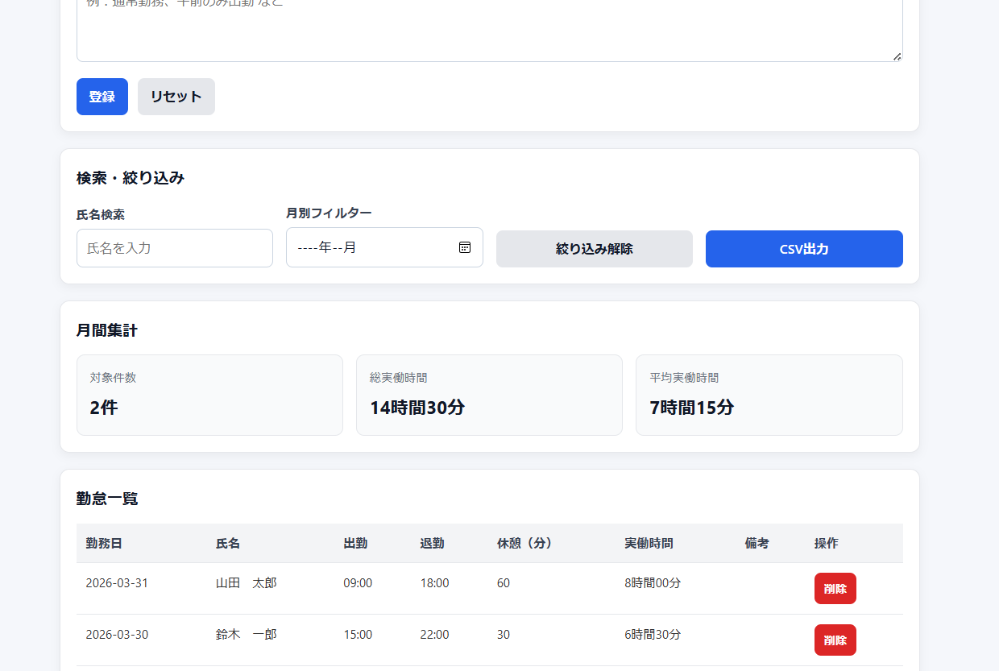
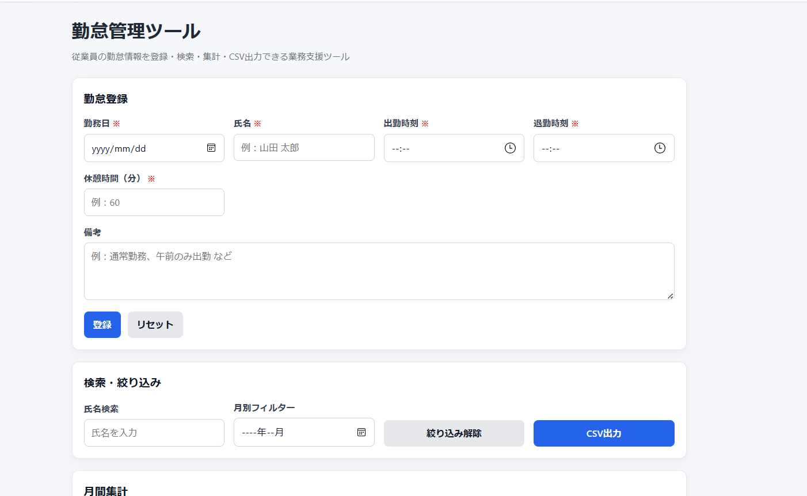

# 勤怠管理ツール（更新）

従業員の勤怠情報を登録・検索・集計・CSV出力できる、ブラウザ上で動作する業務支援ツールです。

---

## 🔗 デモURL
https://ryuunosuke-1113.github.io/attendance-management-app/

---

## 📸 画面イメージ

---

## 🧑‍💼 想定利用者

- 小規模事業者の管理者
- 店舗責任者
- 総務担当 / 人事補助担当

---

## ❗ 解決したい課題

紙やExcelでの勤怠管理では、

- 入力ミスや記録漏れが発生しやすい
- 月次集計に時間がかかる
- データの確認・検索がしづらい

といった課題があります。

本ツールでは、勤怠データの登録から集計・出力までをブラウザ上で完結させることで、業務の効率化を目指しました。

---

## 🛠 主な機能

### ■ 勤怠登録
- 勤務日 / 氏名 / 出退勤 / 休憩 / 備考を入力
- 実働時間を自動計算

### ■ バリデーション
- 必須項目チェック
- 時刻の前後関係チェック
- 休憩時間の不正値チェック
- 重複データの登録防止

### ■ 一覧表示
- 登録データをテーブル形式で表示
- 実働時間を「◯時間◯分」で表示

### ■ 検索・絞り込み
- 氏名検索（部分一致）
- 月別フィルター
- 複数条件の組み合わせ対応

### ■ 集計機能
- 表示中データを対象に集計
  - 件数
  - 総実働時間
  - 平均実働時間

### ■ CSV出力
- 絞り込み結果をそのままCSV出力
- BOM付きでExcel対応
- ダブルクオート対応（カンマ・改行対策）

### ■ UI改善
- 削除確認ダイアログ
- エラー / 成功メッセージ表示
- メッセージの自動消去
- 入力中のメッセージリセット

---

## 💡 工夫した点

- 入力ミス防止のため、バリデーションを強化し、エラー内容を具体的に表示
- 業務での利用を想定し、検索・月別フィルター・集計を組み合わせて使用できるように設計
- CSV出力は「表示中データのみ」を対象にし、実務で使いやすい仕様にした
- 備考欄のカンマや改行にも対応し、CSVのデータ崩れを防止
- 操作ミスを防ぐため、削除時に確認ダイアログを実装
- メッセージ表示を自動制御し、ユーザー体験を改善

---

## 🧱 使用技術

- HTML
- CSS
- JavaScript（Vanilla）
- localStorage

---

## 🔄 今後の改善案

- 編集機能の追加
- 並び替え機能の強化
- 遅刻・残業の自動判定
- ページネーション対応
- データの外部保存（API連携）

---

## 📌 制作背景

事務業務における「入力・確認・集計・出力」の流れを意識し、  
実務で使えるレベルの業務ツールを目指して開発しました。

単なる練習ではなく、業務改善を目的とした設計・実装を意識しています。